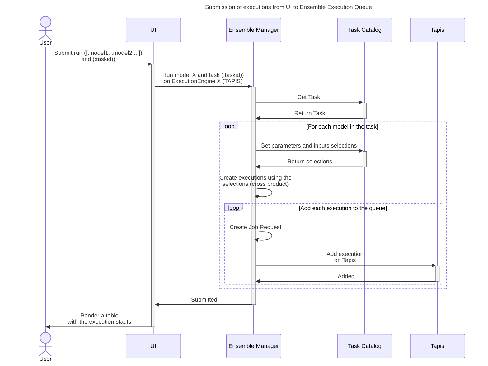
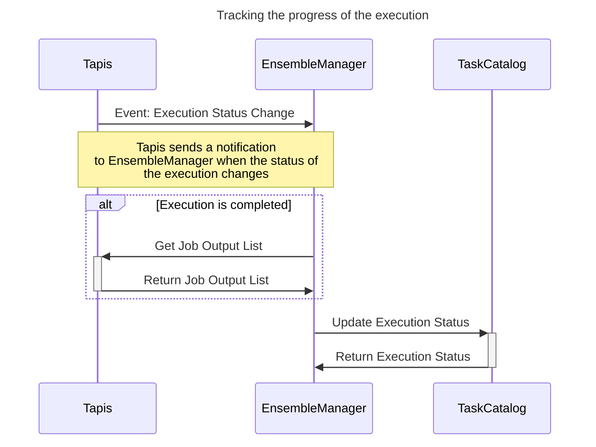

```mermaid
sequenceDiagram
title Submission of executions from UI to Ensemble Execution Queue

    actor User as User
    User->>+UI: Submit run ([:model1, :model2 ...]) <br> and (:taskid))
    UI->>+Ensemble Manager:  Run model X and task (:taskid)) <br> on ExecutionEngine X (TAPIS)
    Ensemble Manager->>+Task Catalog: Get Task
    Task Catalog->>-Ensemble Manager: Return Task

    loop For each model in the task
        Ensemble Manager ->> +Task Catalog:Get parameters and inputs selections
        Task Catalog->>-Ensemble Manager: Return selections
        Ensemble Manager ->> Ensemble Manager: Create executions using the <br>  selections (cross product)

        loop Add each execution to the queue
        Ensemble Manager ->> Ensemble Manager: Create Job Request
            Ensemble Manager ->> +Tapis : Add execution <br> on Tapis
            Tapis ->> -Ensemble Manager : Added
        end

    end
    Ensemble Manager->> -UI:  Submitted
    UI->> -User: Render a table <br> with the execution stauts
```

### Tracking the progress of the execution

```mermaid
sequenceDiagram
title Tracking the progress of the execution

    Tapis ->>EnsembleManager: Event: Execution Status Change
    note over EnsembleManager, Tapis: Tapis sends a notification <br> to EnsembleManager when the status of <br> the execution changes
    alt Execution is completed
        EnsembleManager ->>+Tapis: Get Job Output List
        Tapis ->>-EnsembleManager: Return Job Output List

    end
    EnsembleManager ->>+TaskCatalog: Update Execution Status
    TaskCatalog ->>-EnsembleManager: Return Execution Status

```
