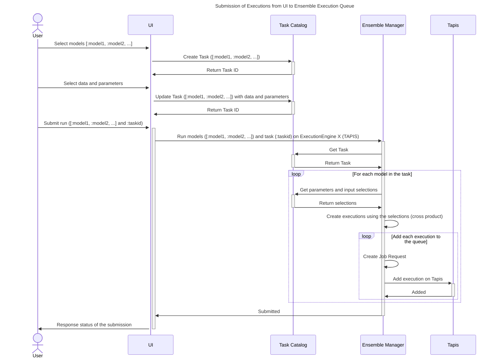
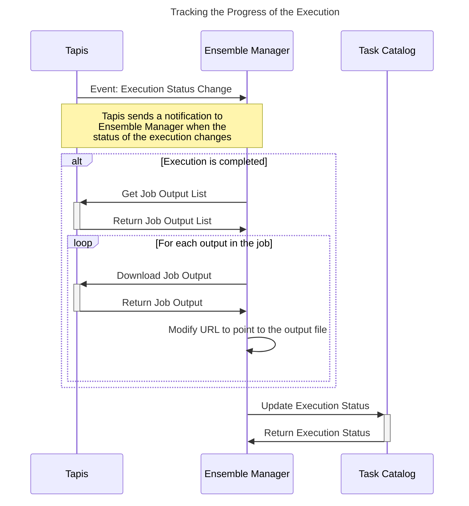
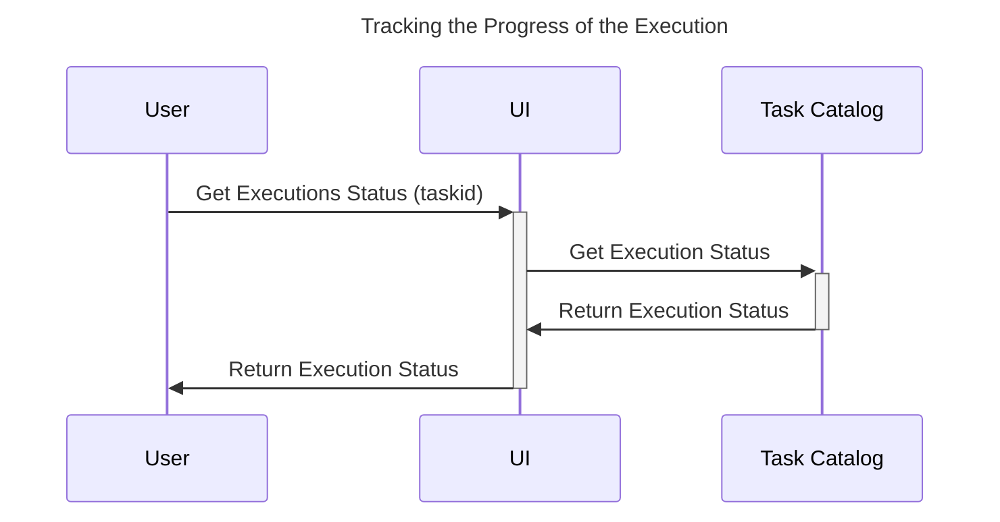

## Submission of Executions from UI to Ensemble Execution Queue


```mermaid
sequenceDiagram
title Submission of Executions from UI to Ensemble Execution Queue

    actor User as User

    User->>+UI : Select models [:model1, :model2, ...]
    UI->>+Task Catalog: Create Task ([:model1, :model2, ...])
    Task Catalog->>-UI: Return Task ID

    User->>+UI: Select data and parameters
    UI->>+Task Catalog: Update Task ([:model1, :model2, ...]) with data and parameters
    Task Catalog->>-UI: Return Task ID

    User->>+UI: Submit run ([:model1, :model2, ...] and :taskid)
    UI->>+Ensemble Manager: Run models ([:model1, :model2, ...]) and task (:taskid) on ExecutionEngine X (TAPIS)
    Ensemble Manager->>+Task Catalog: Get Task
    Task Catalog->>-Ensemble Manager: Return Task

    loop For each model in the task
        Ensemble Manager ->>+Task Catalog: Get parameters and input selections
        Task Catalog->>-Ensemble Manager: Return selections
        Ensemble Manager ->>Ensemble Manager: Create executions using the selections (cross product)

        loop Add each execution to the queue
            Ensemble Manager ->>Ensemble Manager: Create Job Request
            Ensemble Manager ->>+Tapis: Add execution on Tapis
            Tapis ->>-Ensemble Manager: Added
        end

    end
    Ensemble Manager->>-UI: Submitted
    UI->>-User: Response status of the submission
```

## Tracking the Progress of the Execution as Emsemble Manager


```mermaid
sequenceDiagram
title Tracking the Progress of the Execution

    Tapis ->>Ensemble Manager: Event: Execution Status Change
    note over Ensemble Manager, Tapis: Tapis sends a notification to <br> Ensemble Manager when the <br> status of the execution changes
    alt Execution is completed
        Ensemble Manager ->>+Tapis: Get Job Output List
        Tapis ->>-Ensemble Manager: Return Job Output List
        loop For each output in the job
            Ensemble Manager ->>+Tapis: Download Job Output
            Tapis ->>-Ensemble Manager: Return Job Output
            Ensemble Manager ->>Ensemble Manager: Modify URL to point to the output file
        end
    end
    Ensemble Manager ->>+Task Catalog: Update Execution Status
    Task Catalog ->>-Ensemble Manager: Return Execution Status
```

## Tracking the Progress of the Execution as User


```mermaid
sequenceDiagram
title Tracking the Progress of the Execution

    User ->>+UI: Get Executions Status (taskid)
    UI ->>+Task Catalog: Get Execution Status
    Task Catalog ->>-UI: Return Execution Status
    UI ->>-User: Return Execution Status
```

```

```
